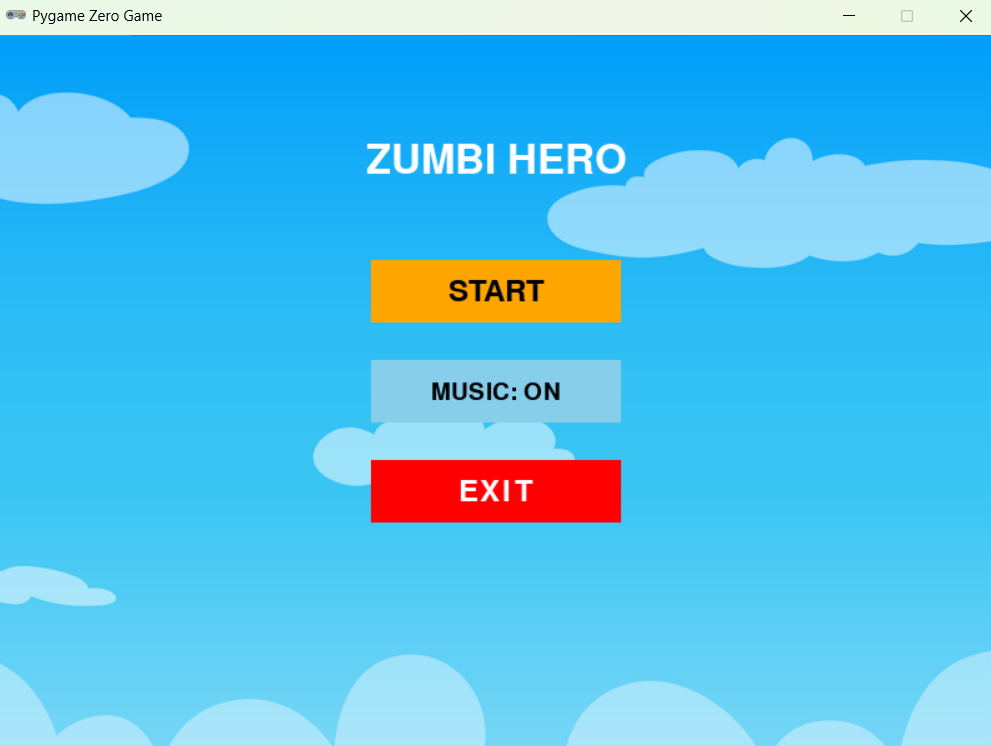
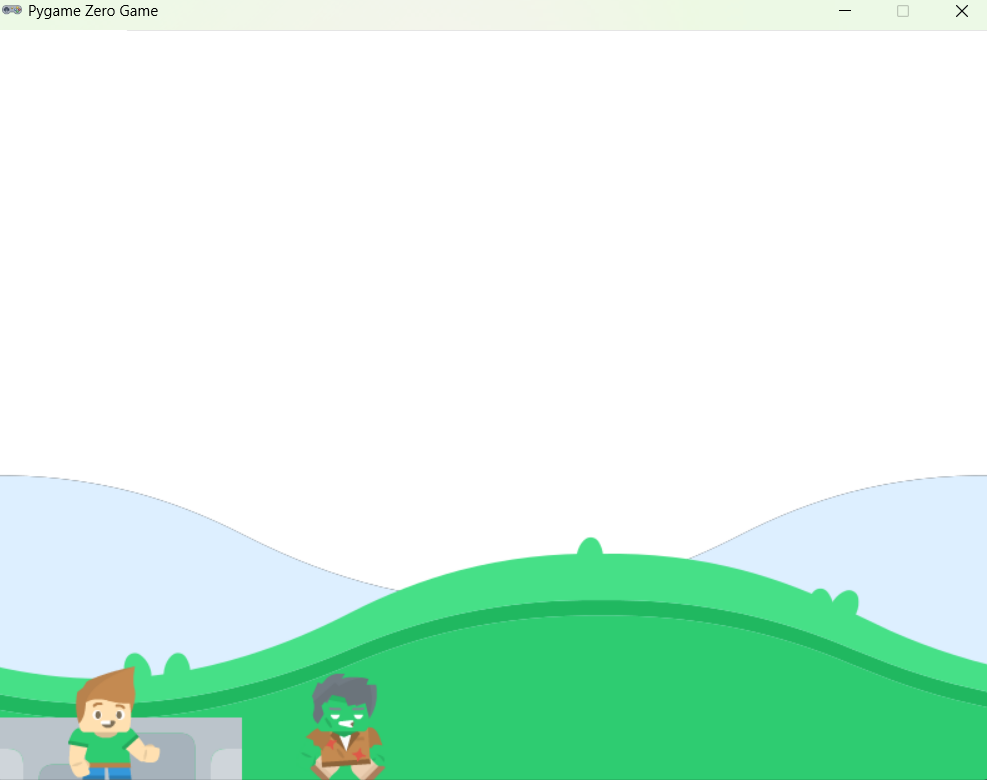

# 🕹️ Platformer Game - Teste para Tutores

Este é um jogo estilo *platformer* criado com **PgZero**.



O Jogo possui *3 fases*, para ganhar cada fase, é preciso pular encima do inimigo e matar todos.

## 📌 Requisitos atendidos

- ✔️ Gênero: Platformer (visão lateral, com plataformas e pulo)
- ✔️ Menu com botões: Iniciar, Música ON/OFF, Sair
- ✔️ Música de fundo e som de pulo
- ✔️ Herói com animações de idle, corrida e pulo
- ✔️ Inimigos com patrulha e animação
- ✔️ Derrota e vitória com telas distintas
- ✔️ Código limpo, organizado e totalmente autoral
- ✔️ Uso apenas de: `pgzrun`, `random`, `math`, `pygame.Rect`

Como jogar:
botão direcionais do teclado : movimenta o heroi.
botão espaço do teclado: pula.



## ▶️ Como rodar o jogo

1. Instale o PgZero:
   ```bash
   1.1 pip install pgzero
   1.2 pgzrun main.py

